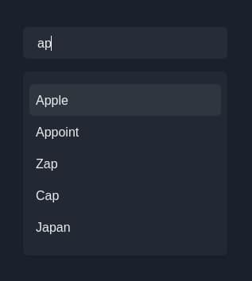
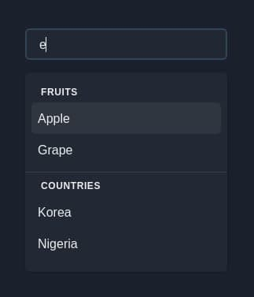
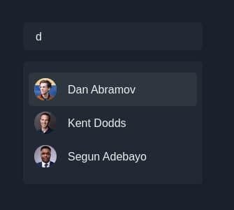

<div align="center">
  <h1>
    <br/>
    🏇
    <br />
    @choc-ui/chakra-autocomplete
    <br />
    <br />
  </h1>
  <sup>
    <br />
    <br />
    <a href="https://www.npmjs.com/package/@choc-ui/chakra-autocomplete?style=for-the-badge">
       
    </a>
    <a href="https://www.npmjs.com/package/@choc-ui/chakra-autocomplete?style=for-the-badge">
      
    </a>
<a>
    
</a>

<a>

</a>
    <br />
    AutoComplete Component for the <a href="https://chakra-ui.com">Chakra UI</a> Library.</em>
    
  </sup>
  <br />
  <br />
  <br />
  <br />
  <pre>npm i <a href="https://www.npmjs.com/package/@choc-ui/chakra-autocomplete">@choc-ui/chakra-autocomplete</a></pre>
  <br />
  <br />
  <br />
  <br />
  <br />
</div>

## Install

```bash
npm i --save @choc-ui/chakra-autocomplete
#or
yarn add @choc-ui/chakra-autocomplete
```

## Preview

### With Mouse


### With Keyboard


## Demo [on Codesandbox](https://codesandbox.io/s/autocomplete-demo-elurs)

## Usage

### Basic Usage

```js
import {
  AutoComplete,
  AutoCompleteInput,
  AutoCompleteItem,
  AutoCompleteList,
} from '@choc-ui/chakra-autocomplete';

export default () => {
  const options = ['apple', 'appoint', 'zap', 'cap', 'japan'];

  return (
    <AutoComplete>
      <AutoCompleteInput
        variant="filled"
        placeholder="Search..."
        defaultValue="ap"
        autoFocus
      />
      <AutoCompleteList rollNavigation>
        {options.map((option, oid) => (
          <AutoCompleteItem
            key={`option-${oid}`}
            value={option}
            textTransform="capitalize"
          >
            {option}
          </AutoCompleteItem>
        ))}
      </AutoCompleteList>
    </AutoComplete>
  );
};
```



---

### Creating Groups

> You can create groups with the `AutoCompleteGroup` Component

```js
import {
  AutoComplete,
  AutoCompleteGroup,
  AutoCompleteInput,
  AutoCompleteItem,
  AutoCompleteList,
} from '@choc-ui/chakra-autocomplete';

export default () => {
  const fruits = ['Apple', 'Grape', 'Pawpaw'];
  const countries = ['Korea', 'Nigeria', 'India'];

  return (
    <AutoComplete>
      <AutoCompleteInput
        variant="filled"
        placeholder="Search..."
        pl="10"
        defaultValue="ap"
        autoFocus
      />
      <AutoCompleteList rollNavigation>
        <AutoCompleteGroup title="Fruits" showDivider>
          {fruits.map((option, oid) => (
            <AutoCompleteItem
              key={`fruits-${oid}`}
              value={option}
              textTransform="capitalize"
            >
              {option}
            </AutoCompleteItem>
          ))}
        </AutoCompleteGroup>
        <AutoCompleteGroup title="countries" showDivider>
          {countries.map((option, oid) => (
            <AutoCompleteItem
              key={`countries-${oid}`}
              value={option}
              textTransform="capitalize"
            >
              {option}
            </AutoCompleteItem>
          ))}
        </AutoCompleteGroup>
      </AutoCompleteList>
    </AutoComplete>
  );
};
```



---

## Accessing the internal state

> To access the internal state of the `AutoComplete`, use a function as children (commonly known as a render prop). You'll get access to the internal state `isOpen` and method `onClose`.

```js
import {
  AutoComplete,
  AutoCompleteInput,
  AutoCompleteItem,
  AutoCompleteList,
} from '@choc-ui/chakra-autocomplete';
import { ChevronDownIcon, ChevronRightIcon } from '@chakra-ui/icons';
import { Icon, InputGroup, InputRightElement } from '@chakra-ui/react';

export default () => {
  const options = ['apple', 'appoint', 'zap', 'cap', 'japan'];

  return (
    <AutoComplete>
      {({ isOpen }) => (
        <>
          <InputGroup>
            <AutoCompleteInput variant="filled" placeholder="Search..." />
            <InputRightElement
              children={
                <Icon as={isOpen ? ChevronRightIcon : ChevronDownIcon} />
              }
            />
          </InputGroup>
          <AutoCompleteList rollNavigation>
            {options.map((option, oid) => (
              <AutoCompleteItem
                key={`optio-${oid}`}
                value={option}
                textTransform="capitalize"
                align="center"
              >
                {option}
              </AutoCompleteItem>
            ))}
          </AutoCompleteList>
        </>
      )}
    </AutoComplete>
  );
};
```

Watch the **Icon** on the **right**.


---

## Custom Rendering

> You can Render whatever you want. The `AutoComplete` Items are regular `Chakra` Boxes.

```js
import {
  AutoComplete,
  AutoCompleteInput,
  AutoCompleteItem,
  AutoCompleteList,
} from '@choc-ui/chakra-autocomplete';
import { Avatar, Box, Text } from '@chakra-ui/react';

export default () => {
  const people = [
    { name: 'Dan Abramov', image: 'https://bit.ly/dan-abramov' },
    { name: 'Kent Dodds', image: 'https://bit.ly/kent-c-dodds' },
    { name: 'Segun Adebayo', image: 'https://bit.ly/sage-adebayo' },
    { name: 'Prosper Otemuyiwa', image: 'https://bit.ly/prosper-baba' },
    { name: 'Ryan Florence', image: 'https://bit.ly/ryan-florence' },
  ];

  return (
    <AutoComplete>
      <AutoCompleteInput
        variant="filled"
        placeholder="Search..."
        pl="10"
        defaultValue="ap"
        autoFocus
      />
      <AutoCompleteList rollNavigation>
        {people.map((person, oid) => (
          <AutoCompleteItem
            key={`option-${oid}`}
            value={person.name}
            textTransform="capitalize"
            align="center"
          >
            <Avatar size="sm" name={person.name} src={person.image} />
            <Text ml="4">{person.name}</Text>
          </AutoCompleteItem>
        ))}
      </AutoCompleteList>
    </AutoComplete>
  );
};
```



---

<!-- ## Multiple Selection

> Add an `AutoCompleteTags` Component to enable multiple selections. -->

## API Reference

**NB**: Feel free to request any additional `Prop` in [Issues](https://github.com/anubra266/choc-autocomplete/issues/new/).

### **AutoComplete**

Wrapper and Provider for `AutoCompleteInput` and `AutoCompleteList`

**AutoComplete** composes [**Box**](https://chakra-ui.com/docs/layout/box) so you can pass all Box props to change its style.

<div class="tg-wrap"><table>
<thead>
  <tr>
    <th>Prop<br></th>
    <th>Type</th>
    <th>Description</th>
    <th>Required</th>
    <th>Default</th>
  </tr>
</thead>
<tbody>
  <tr>
    <td>children</td>
    <td>

```ts
type children =
  |ReactNode
  | (props: {
      isOpen: boolean;
      onClose: () => void;
      inputIsEmpty: boolean;
      resetInput: () => void;
}) => ReactNode;
```

  </td>
    <td>

Children can be a function which is provided with the `isOpen`, `onClose`, `inputIsEmpty`, and `resetInput` props.

  </td>
    <td>No</td>
    <td>&mdash;&mdash;&mdash;</td>
  </tr>
  <tr>
    <td>onChange</td>
    <td>
  
```ts
type onChange =  (value: string) => void;
```

  </td>
    <td>
    
Callback for when the autocomplete value changes, and when input changes if in <br>`freeSolo`<br> mode - returns the value.
    
  </td>
    <td>No</td>
    <td>&mdash;&mdash;&mdash;</td>
  </tr>
  <tr>
    <td>emptyState</td>
    <td>
  
```ts
type emptyState = boolean | ReactNode;
```

  </td>
    <td>Component to display when no options are found. set to true to use default.</td>
    <td>No</td>
    <td><b>No Options Found</b></td>
  </tr>
  <tr>
    <td>rollNavigation</td>
    <td>boolean</td>
    <td>set to true to allow keyboard navigation to restart on both ends.</td>
    <td>No</td>
    <td>false</td>
  </tr>
  <tr>
    <td>focusInputOnSelect</td>
    <td>boolean</td>
    <td>Determines if Input should be focused after an option is selected.</td>
    <td>No</td>
    <td>false</td>
  </tr>
  <tr>
    <td>freeSolo</td>
    <td>boolean</td>
    <td>Set freeSolo to true so the textbox can contain any arbitrary value.</td>
    <td>No</td>
    <td>false</td>
  </tr>
  <tr>
    <td>creatable</td>
    <td>boolean</td>
    <td>If true, allows creation of new Items, `freeSolo` must be true.</td>
    <td>No</td>
    <td>false</td>
  </tr>
  <tr>
    <td>selectOnFocus</td>
    <td>boolean</td>
    <td>select the text in input when input is focused<br>openOnFocus - Open the suggestions once input is focused.</td>
    <td>No</td>
    <td>false</td>
  </tr>
  <tr>
    <td>emphasize</td>
    <td>

```ts
type emphasize = boolean | CSSObject;
```

  </td>
    <td>The parts of the option string that match the <br>`AutoCompleteInput`<br> value are emphasized. Pass boolean to bolden it, or a Chakra <br>`CSSObject`<br> for custom styling.</td>
    <td>No</td>
    <td>false</td>
  </tr>
  <tr>
    <td>defaultIsOpen</td>
    <td>boolean</td>
    <td>If true, the suggestions menu is open by default</td>
    <td>No</td>
    <td>false</td>
  </tr>
  <tr>
    <td>onSelectOption</td>
    <td>
  
```ts
type onSelectOption=  (params: {
    optionValue: string;
    selectMethod: 'click' | 'keyboard';
    isNewInput: boolean;
}) => boolean | void;
```

  </td>
    <td>Will be called every time suggestion is selected via mouse or keyboard. It returns the selectedValue, the selectionMethod and a boolean specifying if the input is a new one; useFul when combined with creatable mode.</td>
    <td>No</td>
    <td>&mdash;&mdash;&mdash;</td>
  </tr>
  <tr>
    <td>suggestWhenEmpty</td>
    <td>boolean</td>
    <td>Return false to prevent selecting the option.</td>
    <td>No</td>
    <td>false</td>
  </tr>
  <tr>
    <td>closeOnBlur</td>
    <td>boolean</td>
    <td>If true, the menu will close when the AutoComplete Component loses focus.</td>
    <td>No</td>
    <td>true</td>
  </tr>
  <tr>
    <td>closeOnselect</td>
    <td>boolean</td>
    <td>If true, the menu will close when an item is selected, by mouse or keyboard.</td>
    <td>No</td>
    <td>true</td>
  </tr>
</tbody>
</table></div>

### **AutoCompleteInput**

Input for `AutoComplete` value.

**AutoCompleteInput** composes [**Input**](https://chakra-ui.com/docs/form/input) so you can pass all Input props to change its style.

### **AutoCompleteList**

Wrapper for `AutoCompleteGroup` and `AutoCompleteItem`

**AutoCompleteList** composes [**Box**](https://chakra-ui.com/docs/layout/box) so you can pass all Box props to change its style.

### **AutoCompleteGroup**

Wrapper for collections of `AutoCompleteItem`s

**AutoCompleteGroup** composes [**Box**](https://chakra-ui.com/docs/layout/box) so you can pass all Box props to change its style.

<div class="tg-wrap"><table>
<thead>
  <tr>
    <th>Prop<br></th>
    <th>Type</th>
    <th>Description</th>
    <th>Required</th>
    <th>Default</th>
  </tr>
</thead>
<tbody>
  <tr>
    <td>title</td>
    <td>string</td>
    <td>The group title</td>
    <td>No</td>
    <td>&mdash;&mdash;&mdash;</td>
  </tr>
  <tr>
    <td>titleStyles</td>
    <td>
    
    TextProps
    
  </td>
    <td>Styles for title decoration, if present</td>
    <td>No</td>
    <td>

```ts
const baseTitleStyles: TextProps = {
  ml: '5',
  mt: '0.5rem',
  fontSize: 'xs',
  letterSpacing: 'wider',
  fontWeight: 'extrabold',
  textTransform: 'uppercase',
};
```

  </td>
  </tr>
  <tr>
    <td>showDivider</td>
    <td>boolean</td>
    <td>If true, a divider is shown</td>
    <td>No</td>
    <td>false</td>
  </tr>
  <tr>
    <td>dividerColor</td>
    <td>string</td>
    <td>Color for divider, if present</td>
    <td>No</td>
    <td>inherit</td>
  </tr>
</tbody>
</table></div>

### **AutoCompleteItem**

This Composes your suggestions

**AutoCompleteItem** composes [**Flex**](https://chakra-ui.com/docs/layout/flex) so you can pass all Flex props to change its style.

<table>
<thead>
  <tr>
    <th>Prop<br></th>
    <th>Type</th>
    <th>Description</th>
    <th>Required</th>
    <th>Default</th>
  </tr>
</thead>
<tbody>
  <tr>
    <td>value</td>
    <td>string</td>
    <td>The value of the Option</td>
    <td>yes<br></td>
    <td>&mdash;&mdash;&mdash;</td>
  </tr>
  <tr>
    <td>_focus</td>
    <td>

    CSSObject

</td>
    <td>Styles for focused Item</td>
    <td>No</td>
    <td>

```js
{
  fontWeight: 'extrabold',
}
```

</td>
</tr>
<!-- <tr>
  <td>disabled</td>
  <td>boolean</td>
  <td>When true, the Item is disabled</td>
  <td>no<br></td>
  <td>&mdash;&mdash;&mdash;</td>
</tr> -->
</tbody>
</table>
