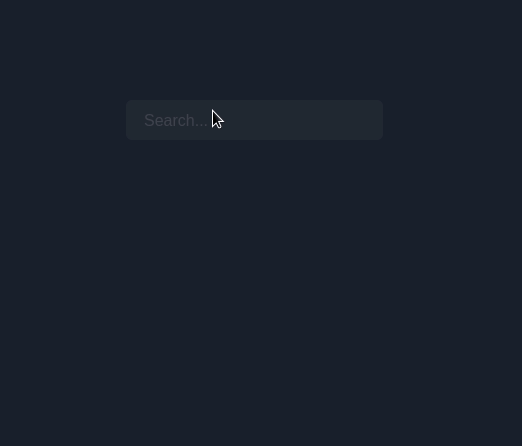
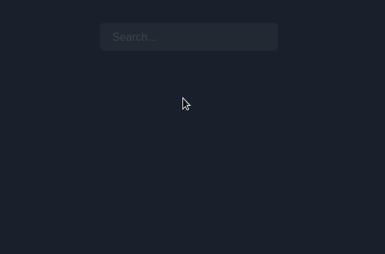
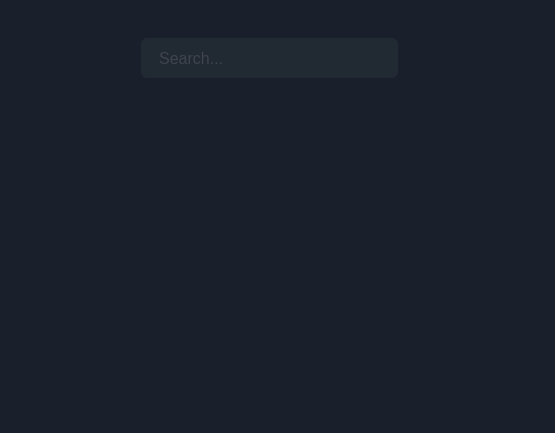

<div align="center">
  <h1>
    <br/>
    🥵
    <br />
    @choc-ui/autocomplete
    <br />
    <br />
  </h1>
  <sup>
    <br />
    <br />
    <a href="https://www.npmjs.com/package/@choc-ui/autocomplete?style=for-the-badge">
       
    </a>
    <a href="https://www.npmjs.com/package/@choc-ui/autocomplete?style=for-the-badge">
      
    </a>
<a>
    
</a>

<a>

</a>
    <br />
    AutoComplete Component for the <a href="https://chakra-ui.com">Chakra UI</a> Library.</em>
    
  </sup>
  <br />
  <br />
  <br />
  <br />
  <pre>npm i <a href="https://www.npmjs.com/package/@choc-ui/autocomplete">@choc-ui/autocomplete</a></pre>
  <br />
  <br />
  <br />
  <br />
  <br />
</div>

## Install

```bash
npm i --save @choc-ui/autocomplete
#or
yarn add @choc-ui/autocomplete
```

## Preview

### With Mouse


### With Keyboard


## Usage

### Basic Usage

```js
import {
  AutoComplete,
  AutoCompleteInput,
  AutoCompleteItem,
  AutoCompleteList,
} from '@choc-ui/autocomplete';

export default () => {
  const options = ['apple', 'appoint', 'zap', 'cap', 'japan'];

  return (
    <AutoComplete>
      <AutoCompleteInput
        variant="filled"
        placeholder="Search..."
        defaultValue="ap"
        autoFocus
      />
      <AutoCompleteList rollNavigation>
        {options.map((option, oid) => (
          <AutoCompleteItem
            key={`option-${oid}`}
            value={option}
            textTransform="capitalize"
          >
            {option}
          </AutoCompleteItem>
        ))}
      </AutoCompleteList>
    </AutoComplete>
  );
};
```


### Creating Groups

> You can create groups with the `AutoCompleteGroup` Component

```js
import {
  AutoComplete,
  AutoCompleteGroup,
  AutoCompleteInput,
  AutoCompleteItem,
  AutoCompleteList,
} from '@choc-ui/autocomplete';

export default () => {
  const fruits = ['Apple', 'Grape', 'Pawpaw'];
  const countries = ['Korea', 'Nigeria', 'India'];

  return (
    <AutoComplete>
      <AutoCompleteInput
        variant="filled"
        placeholder="Search..."
        pl="10"
        defaultValue="ap"
        autoFocus
      />
      <AutoCompleteList rollNavigation>
        <AutoCompleteGroup title="Fruits" showDivider>
          {fruits.map((option, oid) => (
            <AutoCompleteItem
              key={`fruits-${oid}`}
              value={option}
              textTransform="capitalize"
            >
              {option}
            </AutoCompleteItem>
          ))}
        </AutoCompleteGroup>
        <AutoCompleteGroup title="countries" showDivider>
          {countries.map((option, oid) => (
            <AutoCompleteItem
              key={`countries-${oid}`}
              value={option}
              textTransform="capitalize"
            >
              {option}
            </AutoCompleteItem>
          ))}
        </AutoCompleteGroup>
      </AutoCompleteList>
    </AutoComplete>
  );
};
```


## Custom Rendering

> You can Render whatever you want. The `AutoComplete` Items are regular `Chakra` Boxes.

```js
import {
  AutoComplete,
  AutoCompleteInput,
  AutoCompleteItem,
  AutoCompleteList,
} from '@choc-ui/autocomplete';
import { Avatar, Box, Text } from '@chakra-ui/react';

export default () => {
  const people = [
    { name: 'Dan Abramov', image: 'https://bit.ly/dan-abramov' },
    { name: 'Kent Dodds', image: 'https://bit.ly/kent-c-dodds' },
    { name: 'Segun Adebayo', image: 'https://bit.ly/sage-adebayo' },
    { name: 'Prosper Otemuyiwa', image: 'https://bit.ly/prosper-baba' },
    { name: 'Ryan Florence', image: 'https://bit.ly/ryan-florence' },
  ];

  return (
    <AutoComplete>
      <AutoCompleteInput
        variant="filled"
        placeholder="Search..."
        pl="10"
        defaultValue="ap"
        autoFocus
      />
      <AutoCompleteList rollNavigation>
        {people.map((person, oid) => (
          <AutoCompleteItem
            key={`option-${oid}`}
            value={person.name}
            textTransform="capitalize"
            align="center"
          >
            <Avatar size="sm" name={person.name} src={person.image} />
            <Text ml="4">{person.name}</Text>
          </AutoCompleteItem>
        ))}
      </AutoCompleteList>
    </AutoComplete>
  );
};
```


## API Reference

**NB**: Feel free to request any additional `Prop` in [Issues](https://github.com/anubra266/choc-autocomplete/issues/new/).

### **AutoComplete**

Wrapper and Provider for `AutoCompleteInput` and `AutoCompleteList`

**AutoComplete** composes [**Box**](https://chakra-ui.com/docs/layout/box) so you can pass all Box props to change its style.

**NB**: If you have more than one `AutoComplete` Component on a page, they must be assigned unique `id`s

---

`onChange`

---

**Description**

> Function that provides current Input value and is called anytime, suggestion is selected- useful for uncontrolled Input, but wants to use Value

**Type**

```ts
(value: string) => void
```

**Default**

`null`

**Required**

No

---

`onSelectOption`

---

**Description**

> Will be called every time suggestion is selected via mouse or keyboard.

**Type**

```ts
(optionValue: string, selectMethod: 'click'|'keyboard') => void;
```

**Default**

`null`

**Required**

No

---

`onOptionHighlight`

---

**Description**

> Will be called every time the highlighted option changes.

**Type**

```ts
(optionValue: string) => void
```

**Default**

`null`

**Required**

No

---

`emphasize`

---

**Description**

> The parts of the option string that match the `AutoCompleteInput` value are emphasized. Pass boolean to bolden it, or a Chakra `CSSObject` for custom styling.
> e.g.

```html
<AutoComplete emphasize>
  ...
</AutoComplete>

<!--Or-->

<AutoComplete emphasize={{ color: 'blue.400', fontWeight: 'bold' }}>
  ...
</AutoComplete>
```



**Type**

```ts
boolean | CSSObject;
```

**Default**

```ts
const emphasizeStyles = {
  fontWeight: 'extrabold',
};
```

**Required**

No

---

`shouldRenderSuggestions`

---

**Description**

> By default, suggestions are rendered when the input isn't blank. Feel free to override this behaviour. This function gets the current value of the input
> **e.g.**

```ts
function shouldRenderSuggestions(value) {
  return value.trim().length > 2;
}
```

**Type**

```ts
(value: string) => void
```

**Default**

`null`

**Required**

No

---

`focusInputOnSelect`

---

**Description**

> Determines if Input should be focused after Select

**Type**

```ts
boolean;
```

**Default**

`true`

**Required**

No

---

`closeOnSelect`

---

**Description**

> If true, the menu will close when an item is selected, by mouse or keyboard.

**Type**

```ts
boolean;
```

**Default**

`true`

**Required**

No

---

`closeOnBlur`

---

**Description**

> If true, the menu will close when the `AutoComplete` Component loses focus.

**Type**

```ts
boolean;
```

**Default**

`true`

**Required**

No

---

`suggestWhenEmpty`

---

**Description**

> If the suggestions shoud show when the input is Empty. - It is used when the input is focused.

**Type**

```ts
boolean;
```

**Default**

`false`

**Required**

No

---

`suggestWhenEmpty`

---

**Description**

> Component to render when no match is found. Pass null, to just close the menu.

**Type**

```ts
ReactNode;
```

**Default**

`null`

**Required**

No

### **AutoCompleteInput**

Input for `AutoComplete` value.

**AutoComplete** composes [**Input**](https://chakra-ui.com/docs/form/input) so you can pass all Input props to change its style.

---

`onChange`

---

**Description**

> When you want the AutoComplete in controlled mode, it's a function that returns, the change event anytime the input value changes.

**Type**

```ts
(e: ChangeEVent) => void
```

**Default**

`undefined`

**Required**

No

---

`value`

---

**Description**

> The value of the `AutoComplete` input in controlled mode. You should store this in state. And it must bes used with the `onChange` prop.

**Type**

```ts
string;
```

**Default**

`undefined`

**Required**

No

### **AutoCompleteList**

Wrapper for `AutoCompleteGroup` and `AutoCompleteItem`

**AutoCompleteList** composes [**Box**](https://chakra-ui.com/docs/layout/box) so you can pass all Box props to change its style.

---

`rollNavigation`

---

**Description**

> Determines if keyboard navigation should roll over after getting to either ends.

**Type**

```ts
boolean;
```

**Default**

`false`

**Required**

No



### **AutoCompleteGroup**

Wrapper for collections of `AutoCompleteItem`s

**AutoComplete** composes [**Box**](https://chakra-ui.com/docs/layout/box) so you can pass all Box props to change its style.

---

`showDivider`

---

**Description**

> Determines if a divider should be rendered above the group. The **divider** will automatically be unrendered when that group is first in that suggestions.

**Type**

```ts
boolean;
```

**Default**

`null`

**Required**

No



---

`dividerColor`

---

**Description**

> Color for the group divider, when `showDivider` is `true`

**Type**

```ts
string;
```

**Default**

`inherit`

**Required**

No

---

`titleStyles`

---

**Description**

> Styles to be applied to group's `title`. It Composes [**Text**](https://chakra-ui.com/docs/layout/box) so you can pass all Text props to change its style.

**Type**

```ts
TextProps;
```

**Default**

```ts
const textStyles: TextProps = {
  fontSize: 'xs',
  textTransform: 'uppercase',
  fontWeight: 'extrabold',
  letterSpacing: 'wider',
  ml: '5',
};
```

**Required**

No

### **AutoCompleteItem**

This Composes your suggestions

**AutoComplete** composes [**Flex**](https://chakra-ui.com/docs/layout/flex) so you can pass all Flex props to change its style.

---

`_focus`

---

**Description**

> Like the default pseudo `_focus`, but this determines the style applied when that `Item` highlighted by mouse or keyboard,

**Type**

```ts
CSSObject;
```

**Default**

```ts
const _focus = {
  bg: useColorModeValue('gray.200', 'whiteAlpha.100'),
};
```

**Required**

No
